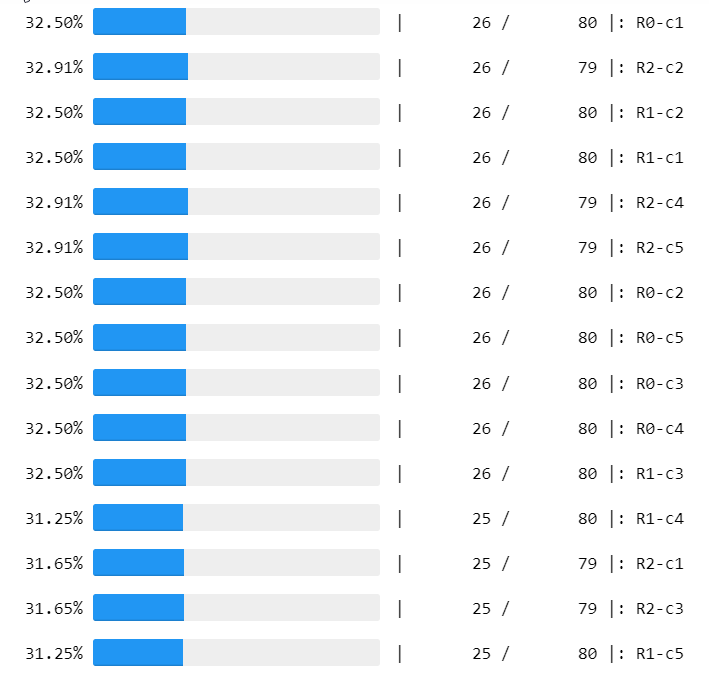

# Cyclic Immunofluorescence Registration Pipeline

If using within OHSU or the Mills Lab, see the [wiki](https://github.com/nathanieljevans/cyclicIF_registration/wiki/Mills-Lab-Example) for more specific instructions. 

To set up a remote jupyter notebook kernel on exahead, follow [these](https://github.com/nathanieljevans/cyclicIF_registration/wiki/Exahead-Jupyter-Kernel-Instructions) instructions. 

--- 

## Environment 

use `environment.yml` to set up conda environment. 

## Pipeline 

Currently, the data directories are hard coded into the `.sh` files. Future work will add command line functionality to define those. To edit this, open the `.sh` file and modify the variables at the top of the script to define `input`, `output`, `slide`, `scene`.

To run the registration pipeline for a single experiment: 

```$ ./run_registration.sh```

To run this pipeline in parrallel, use: 

```$ ./run_registration_batch.sh```
 
Once all images have been registered, the metadata and results can be aggregated by running: 

```$ python aggregate_results.py --dir /home/exacloud/lustre1/NGSdev/evansna/cyclicIF/output```
 
For specific pipeline steps, see `tutorial.ipynb` 

## Output Structure

```
output
│  └ registration_results.csv 
│       
│
└───<slide_name_01>
│   │
│   │       
│   └───<scene_name_01>
│   │     │
│   │     │
│   │     └──<core_label_01>
│   │     │      └ batch_log_file.log
│   │     │      └ core_meta.csv
│   │     │      └ registration_eval.csv
│   │     │      └ registered_core=1_round=R1_color=c1.tif
│   │     │      └ ...
│   │     │      └ unregistered_core=1_round=R1_color=c1.tif
│   │     │      └ ...
│   │     │
       
```

> batch_log_file.log:                         log file for the sbatch command   

> core_meta.csv:                              meta data for core, includes shape statistics for the dapi segmentations   

> registration_eval.csv:                      registration eval metrics  

> registered_core=1_round=R1_color=c1.tif     registered image: round, color channel  

> unregistered_core=1_round=R1_color=c1.tif   unregistered image: round, color channel (**note:** R0, c1 is the DAPI fixed channel that all others are registered too.   

> registration_results.csv                    aggregated results from all experiments/cores.   


## Results 

To interact with the results (especially if you're working on a remote file system), it's easiest to use the `results.ipynb` notebook. This allows the user to visualize experiment segmentations and registered images. Additionally, registration metrics can be evaluated to identify outliers. 


## Re-stitching Cores

To re-stitch the cores back into a single `round-color` image, this can be done in the results notebook or command line interface. For time complexity, it is recommended to use the multithreaded option, which will visualize progress as (Note-progress bar is currently not working. environment issues): 



To re-stitch images in command line, use: 

```bash 
$ python restitch_cores.py --results_path /home/exacloud/lustre1/NGSdev/evansna/cyclicIF/output/aggregated_results.csv --output /home/exacloud/lustre1/NGSdev/evansna/cyclicIF/output/S3/Scene-1/ --slide S3 --scene Scene-1 --qc None
```

For command line options, see: 
```bash
$ python restitch_cores.py --help

usage: restitch_cores.py [-h] [--results_path RESULTS] [--output OUTPUT] [--slide SLIDE] [--scene SCENE]
                         [--qc QC_METHOD]

Restitching a set of registered cores given Round,Scene,Core IDs.

optional arguments:
  -h, --help            show this help message and exit
  --results_path RESULTS
                        registration results csv path
  --output OUTPUT       output directory where the restitched images will be written to disk.
  --slide SLIDE         slide name (identifier)
  --scene SCENE         scene name (identifier)
  --qc QC_METHOD        qc method: Can be ["None", "Auto", "/path/to/file/with/line/sep/core/ids/to/filter"]
```

## Quality Control 

Quality control is best implemented at the `re-stitching` step. There are three options, No QC, auto QC or manual QC. 

`auto` QC will filter any round-core registrations that do not pass the thresholds specified in `config.py`. 
`manual` QC can be performed by passing either a list (in `results.ipynb`) or a text file path (in `restitch_cores.py`) of cores that should not be restiched. 
`None` will perform no QC and all cores/rounds will be re-stitched. 

 
